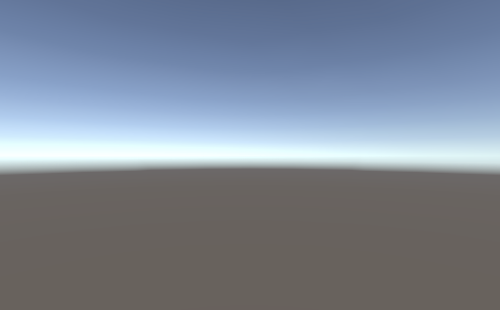

# *The Nothings Suite*

*Nothing to see here! But don't move along! You can really see the nothing here! Examine the nothing! Think about the nothing! The nothing is where it all begins!*

---

_The Nothings Suite_ is a collection of (extremely) short videogames made with diverse videogame engines such as Unity, Twine, and PICO-8. In each case, a game has been produced with the engine using, as much as possible, no creative input at all. That is, in the ideal scenario I open the game engine, save the project it creates by default as "Nothing" and export it for play. This means you get to see each game engine's idea of what "nothing" (or at least no effort) looks like when you set out to make a game with it.

*The Nothings Suite* currently consists of the following nothings:
1. [Nothing (Twine)](#nothing-twine)
1. [Nothing (Inky)](#nothing-inky)
1. [Nothing (Bitsy)](#nothing-bitsy)
1. [Nothing (Flickgame)](#nothing-flickgame)
1. [Nothing (PuzzleScript)](#nothing-puzzlescript) (two versions!)
1. [Nothing (PICO-8)](#nothing-pico-8)
1. [Nothing (Inform 7)](#nothing-inform-7)
1. [Nothing (Construct 3)](#nothing-construct-3)
1. [Nothing (Stencyl)](#nothing-stencyl)
1. [Nothing (Unity)](#nothing-unity)
1. [Nothing (Godot)](#nothing-godot)
1. [Nothing (Unreal Engine 4)](#nothing-unreal-engine-4-with-andrew-baker)
1. [Nothing (Ren'Py)](#nothing-renpy)
1. [Nothing (Print-and-Play)](#nothing-print-and-play)
1. [Nothing (p5.js Web Editor)](#nothing-p5js-web-editor)
1. [Nothing (ZZT)](#nothing-zzt)
1. [Nothing (batari Basic)](#nothing-batari-basic)
1. [Nothing (GB Studio)](#nothing-gb-studio)
1. [Nothing (Adventure Game Studio)](#nothing-adventure-game-studio)
1. [Nothing (LÖVE)](#nothing-löve)

Nothings made by other people:

1. [Nothing (dreams)](#nothing-dreams-by-karsten-staack) (by Karsten Staack)
1. [Nothing (GDevelop)](#nothing-gdevelop-by-yadier-jimenez) (by Yadier Jimenez)

You can also read about the suite's [development and thought process](#would-you-like-to-know-more).

---

#### [Nothing](https://pippinbarr.github.io/the-nothings-suite/twine/) (Twine)

[Twine](http://twinery.org/) is a flexible hypertext creation tool. The minimal Twine game is a single webpage with default styling containing the instruction: *"Double-click this passage to edit it."* This is the only engine profiled here that references its own user interface by default, pointing the nothing-player to the underlying idea of *making* a Twine game.

[Play this nothing](https://pippinbarr.github.io/the-nothings-suite/twine/)

---

#### [Nothing](https://pippinbarr.github.io/the-nothings-suite/inky/) (Inky)

[Inky](https://github.com/inkle/inky/releases/tag/0.12.0) is the editor for the [Ink](https://www.inklestudios.com/ink/) scripting language, used to write interactive fiction. This Nothing is interesting for the way it promotes its own tool, proclaiming *"WRITTEN IN INK"* at the top of its webpage. To actually export this this empty Ink story, I had to first write a character, save the file, then delete it and save again. Is it really nothing, or does the ghost of that character remain?

[Play this nothing](https://pippinbarr.github.io/the-nothings-suite/inky/)

---

#### [Nothing](https://pippinbarr.github.io/the-nothings-suite/bitsy/) (Bitsy)

[Bitsy Game Maker](https://ledoux.itch.io/bitsy) (by Adam LeDoux) is an accessible tool for creating "little games or worlds", generally in low resolution 2D visuals. The "nothing" produced here is extensive, containing a title screen, an avatar the player can navigate around a room, and a cat for them to talk to (*"I'm a cat"*). This impressively "playable" nothing is telling the accessibility of the tool: these elements are in place by default so that a user new to the Bitsy Game Maker is able to quickly edit the visuals and texts already in place to begin their own project.

[Play this nothing](https://pippinbarr.github.io/the-nothings-suite/bitsy/)

---

#### [Nothing](https://pippinbarr.github.io/the-nothings-suite/flickgame/) (Flickgame)

[Flickgame](https://www.flickgame.org/) by [Increpare](https://www.increpare.com/index.html) is an ultra-accessible tool for creating a game made up of hyperlinked hand-drawn images, where links between pages are based on colors. This "nothing" is an empty aubergine purple rectangle that links to nothing, the absence of a drawing and the absence of links. The exported HTML file is only 17KB, the smallest (potentially) interactive nothing in this collection. The source code is also quite readable in the HTML, emphasizing Increpare's commitment to open source with this tool ([repository here](https://github.com/increpare/flickgame)).

[Play this nothing](https://pippinbarr.github.io/the-nothings-suite/flickgame/)

---

#### [Nothing](https://pippinbarr.github.io/the-nothings-suite/puzzlescript/nothing.html) (PuzzleScript)

[PuzzleScript](https://www.puzzlescript.net/) is an open source puzzle game engine by [Increpare](https://www.increpare.com/index.html).

##### v.1

This "nothing" is the only "playable game" in this overall suite in the traditional sense: a simple [Sokoban](https://en.wikipedia.org/wiki/Sokoban) level the player can interact with and complete (walkthrough: press the right arrow three times!). This is another nod to accessibility, in this case helping to explain to the user of PuzzleScript through example how its underlying scripting language works at its most fundamental. This is multi-layered nothing - with no additional level data, nor PuzzleScript, nor underlying JavaScript - pointing to the complexity of even "simple" tools.

[Play this nothing](https://pippinbarr.github.io/the-nothings-suite/puzzlescript/v1/nothing.html)

##### v.2

This "nothing" has been created in response to [@zarawesome](https://twitter.com/zarawesome)'s note that there is actually a Blank Project template available in PuzzleScript. I started with the Blank Template, but it doesn't compile successfully. As such, [I kept adding elements in response to the error messages](process/process-journal.md#puzzlescript-v2-27-04-2021-1533) until I had what seems to be the minimum project viewed as acceptable by the PuzzleScript engine. It's a single tile level with just the player standing there, rather confined by the 1 dimensionality of their world. Would it be more nothing-y if it was just the background, with no player? Hard to say.

[Play this nothing](https://pippinbarr.github.io/the-nothings-suite/puzzlescript/v2/nothing.html)

---

#### [Nothing](https://pippinbarr.github.io/the-nothings-suite/pico8/) (PICO-8)

[PICO-8](https://www.lexaloffle.com/pico-8.php) is a "fantasy console" with an associated development environment for making limited but potential-filled small games. Producing this "nothing" was challenging because PICO-8 is less immediately "friendly" than other game engines, in keeping with its demand that you commit to its technical fantasy world. The nothingness here is due to an empty source code file (`.p8` extension) being used to "create" the resulting game. The game freezes at *"BOOTING CARTRIDGE..."*, but displays no errors either in the fantasy console or the JavaScript console. There's just nothing there for PICO-8 to do.

[Play this nothing](https://pippinbarr.github.io/the-nothings-suite/pico8/)

---

#### [Nothing](https://pippinbarr.github.io/the-nothings-suite/inform7/Nothing.gblorb) (Inform 7)

[Inform 7](http://inform7.com/) is a "Design System for Interactive Fiction", prominently featuring a natural-language programming environment. The source code for this "nothing" is first the line `"Nothing" by Pippin Barr` and then the line `Example Location is a room.`, the default generated on creating a new project. Despite the almost total lack of content, the resulting game is expansive thanks to the nature of the Inform 7 engine. In particular, you can perform many actions in its world - such as jumping, talking, and looking at yourself (*"as good-looking as ever"*) - because the engine itself has so many default responses in place. Of course, this world is also incredible claustrophobic - the abyss of its nothingness shows.

**Note:** Because the only way to make an Inform 7 game playable in the browser is to add text to its existing code, I was unable to make it accessible in that way. Instead, you'll have to download the `.gblorb` file and play it with an *interpreter*. Consider [Spatterlight](http://ccxvii.net/spatterlight/) (Mac), [Filfre](http://maher.filfre.net/filfre/index.html) (Windows), or [Gargoyle](http://ccxvii.net/gargoyle/) (Linux).

[Download this nothing](https://pippinbarr.github.io/the-nothings-suite/inform7/Nothing.gblorb)

---

#### [Nothing](https://pippinbarr.github.io/the-nothings-suite/construct3/) (Construct 3)

[Construct 3](https://www.construct.net/en) is a game creation tool focused on visual scripting and accessibility to non-programmers. This was one of the least eventful nothings to create, and yields a fairly standard player experience: a loading screen (*"Powered by Construct 3"*) followed by a blank white canvas that is totally non-interactive. This feels like it mirrors the rather banal nature of Construct 3 and other more generic forms of game engine that attempt, at some level, to be all things to all people. The only element of note that surprised me that in a default export of a Construct 3 game it includes an "offline mode" to make the game playable without an internet connection - a nice feature, but one which took over my machine's local server setup and made it impossible to develop my own work. A deeply invasive nothing.

[Play this nothing](https://pippinbarr.github.io/the-nothings-suite/construct3/)

---

#### [Nothing](https://pippinbarr.github.io/the-nothings-suite/stencyl/) (Stencyl)

[Stencyl](http://www.stencyl.com/) is a similar tool to Construct 3. It, too, has a visual scripting environment and the ability to export to many platforms. The nothing was similarly easy to create, though the resulting experience is distinct in that it doesn't advertise Stencyl itself by default. The default template used is called "Blank Game" and it sure is blank - I quite like that it fades from black (loading screen) to white, effectively erasing itself from view as it presents its nothingness to the player.

[Play this nothing](https://pippinbarr.github.io/the-nothings-suite/stencyl/)

---

#### [Nothing](https://pippinbarr.github.io/the-nothings-suite/unity/) (Unity)

[Unity](https://unity.com/) is one of the major "make absolutely anything" game engines along with Unreal Engine and Godot, with a particular focus on 3D game creation. I've made a number of games in Unity previously, so the process was smooth to create an empty project and then export it to WEBGL for viewing on a webpage. The player experience of the nothing is a standard Unity loading screen followed by an empty horizon above a brown/gray nothingness. By implication there's also a camera (that you're seeing through) and a light (that is illuminating the scene). To me, this is the iconic nothing.

[Play this nothing](https://pippinbarr.github.io/the-nothings-suite/unity/) (currently broken in some versions of Chrome)

---

#### [Nothing](https://pippinbarr.github.io/the-nothings-suite/godot/Nothing.html) (Godot)

The [Godot Engine](https://godotengine.org/) is a free and open source game engine in a similar vein to Unity. Not having made a game in the engine before, creating this nothing was a bit of an adventure as I first had to install a specific "export template" (400MB!) to create the WEBGL version and it felt a little less clear than other software. That said, once it was ready to export, it exported fine. The player experience is actually an *error* however: if you check the JavaScript console in the browser you see `Error: Can't run project: no main scene defined.`. That is, Godot does not provide a default "scene" for your new game to take place in, you must create it explicitly. Now that's nothing.

[Play this nothing](https://pippinbarr.github.io/the-nothings-suite/godot/Nothing.html)

---

#### [Nothing](https://pippinbarr.github.io/the-nothings-suite/unrealengine4/) (Unreal Engine 4, with [Andrew Baker](https://failrate.itch.io/))

[Unreal Engine 4](https://www.unrealengine.com/) is the third of the big 3D engines in this suite. This nothing was unique in that I required a collaborator in Andrew Baker to actually produce the resulting game according to the project brief of creating a game with the engine include no or minimal additions to the engine default. Andrew was extremely thorough and the resulting nothing is representative of Unreal's "Blank" project. As with both Bitsy and PuzzleScript, the blankness is actually rather developed as the player can fly around a in a first-person view and bump into a single platform floating there. It is therefore complete with lighting, physics, player input, and so on. Due to the web export, it also comes with an unsightly additional default interface around it for toggling logs, pausing the game, and more. A whole lot of nothing.

[Play this nothing](https://pippinbarr.github.io/the-nothings-suite/unrealengine4/)

---

#### [Nothing](https://pippinbarr.github.io/the-nothings-suite/renpy/) (Ren'Py)

The [Ren'Py Visual Novel Engine](https://www.renpy.org/) is software for creating visual novels. I had originally thought this would be an interesting way for me to engage with visual novel culture, but this particular nothing handily demonstrated to me that the pursuit of "nothing" in a game engine tends to obfuscate rather than clarify the nature of a tool. As such, I know next to nothing about Ren'Py or visual novel production. The nothing produced, however, is intriguing in its sheer complexity. It includes a download sequence, a loading screen with a picture of a woman holding a globe, and a detailed menu system. It also names the game *Nothing 1.0* which I enjoy significantly. Starting the game itself from the menu leads to overlapping errors around missing images that Ren'Py does not provide defaults for, but also two lines of dialog from a character called Eileen: `You've created a new Ren'Py game.` and `Once you add a story, pictures, and music, you can release it to the world!` No, nothing ironic about that.

[Play this nothing](https://pippinbarr.github.io/the-nothings-suite/renpy/)

---

#### [Nothing](https://pippinbarr.github.io/the-nothings-suite/print-and-play/nothing.pdf) (Print-and-Play)

In the tradition of "print and play" games that provide instructions for how to play non-digital games such as LARPs, board games, card games and more. The nothing here is therefore a blank PDF, produced in Microsoft Word as a blank document before exporting. A mere 12KB for so much potential. The implied player experience is somehow one of unlimited freedom because the game context is the real world rather than the constrained world of a videogame engine (perhaps Inform 7 comes the closest to this sense of freedom in a digital context?). With no rules and no aesthetic forms to guide you on how to "play" this nothing, you could do anything? Or is it that you can do nothing?

[Download this nothing](https://pippinbarr.github.io/the-nothings-suite/print-and-play/nothing.pdf)

---

#### [Nothing](https://editor.p5js.org/pippinbarr/sketches/c8d0M-cxX) (p5.js Web Editor)

[p5.js](https://p5js.org/) is a truly excellent JavaScript library aimed at simplifying visual programming for artists and beginners - I teach it in my introductory programming class. This nothing is particularly interesting in that it's created with p5.js's Web Editor, meaning that when you visit it you explicitly see the default JavaScript code itself. It comes with a play button, so you can also see the game running alongside its code, which is a very intriguing and very explicit invitation for anyone to "just start coding" right away. Imagine the possibilities available if you built upon this nothing!

[Play this nothing](https://editor.p5js.org/pippinbarr/sketches/c8d0M-cxX)

---

#### [Nothing](https://pippinbarr.github.io/the-nothings-suite/zzt/) (ZZT)

[ZZT](http://zzt.org/) is a game engine from back in 1991 that runs on DOS and produces extremely charming ASCII (and ANSI?) worlds (*International Jetpack Conference* is a favourite, though hard to source now). ZZT is a particularly interesting engine because it is both editor and player at the same time: when you load this nothing, you can equally hit P to play the Nothing I made, or you can hit E to open the editor and make something of your own. This is a very powerful version of the idea repeated throughout this suite that a game might communicate or make available the engine of creation. The nothing itself is a nice one, with a smiling avatar in a big blank room and the implication of torches and ammo telling us something about the way ZZT perceives its worlds. The game is playable online thanks to [Zeta](https://zeta.asie.pl/). You could also read Anna Anthropy's truly excellent book on ZZT called... what was it? Oh yes, [ZZT](https://bossfightbooks.com/products/zzt-by-anna-anthropy).

[Play this nothing](https://pippinbarr.github.io/the-nothings-suite/zzt/)

[Download the .ZZT source file](https://pippinbarr.github.io/the-nothings-suite/zzt/NOTHING.ZZT)

---

#### Nothing (batari Basic)

[batari Basic](http://bataribasic.com/) is a programming language for the Atari 2600 that compiles to files that can be read as cartridges in emulators for the system. The Atari 2600 has a lot of personal significance to me because I've used its visual aesthetics and system limitations in various other projects. I also especially like this nothing because it's generated from a source file, [`nothing.bas`](https://pippinbarr.github.io/the-nothings-suite/batari-basic/nothing.bas), that has literally no size - the ultimate in nothingness, perhaps? On the other hand, I assume one could also produce an actual physical cartridge from the compiled output too, and that would be quite something.

**Note:** To play this nothing you'll need an Atari 2600 emulator to load the file into. You can go for [Javatari](https://javatari.org/) if you want a version on the web, or [Stella](https://stella-emu.github.io/) if you want something on your PC.

[Download this nothing](https://pippinbarr.github.io/the-nothings-suite/batari-basic/Nothing.a26)

[Download the .bas source file](https://pippinbarr.github.io/the-nothings-suite/batari-basic/nothing.bas)

---

#### Nothing (GB Studio)

[GB Studio](https://www.gbstudio.dev/) is a "retro game creator" for Game Boy games. It can export both for the web and as a ROM file readable by a Game Boy (or emulator), so it's all very authentic. This nothing provoked a [surprising amount of soul searching](process/process-journal.md#gb-studio-22-04-2021-1032) for me in terms of my rules of nothingness and even led me to codify more explicit rules for the suite. That's because the **default** (least effort) template project to create is a "Sample Project" that contains a full game's worth of material, but there is also a "Blank Project" template available in the same menu which creates a rather more minimalistic (and nothing-like) project. After struggling with the correct path, this nothing uses the "Blank Project" as being more in the spirit of The Nothings Suite.

[Play this nothing](https://pippinbarr.github.io/the-nothings-suite/gbstudio/build/web/)

[Download this nothing as a Game Boy ROM](https://pippinbarr.github.io/the-nothings-suite/gbstudio/build/rom/game.gb)

---

#### Nothing (Adventure Game Studio)

[Adventure Game Studio](https://www.adventuregamestudio.co.uk/site/ags/) is a tool for making adventure games (think *Space Quest*)! The nothing here required the most work of any nothing in the suite thus far as after starting an "Empty Game" template I wasn't able to build the game because it told me the game was set to start in room -1 which didn't exist. Then after figuring out how to add a Blank Room, it still wouldn't compile for the same reason (the new room was number 1). It took actual internet sleuthing to find out where this setting is in the tool, ultimately yielding the fact I had to change the StartingRoom property of the default character known a cCharacter (Character 0) to point to my blank room 1 instead of "(None)". The compiled game itself is actually quite interesting because despite being a black screen, various debug commands are available (Ctrl-D, Ctrl-X, Ctrl-V) that give you information about the nature of the game world (including the position of the invisible player character). This debug information in turn makes it seem more like the game is set in a very dark room, rather than being empty. It's an almost intimate nothingness?

[Download this nothing (Windows)](https://pippinbarr.github.io/the-nothings-suite/ags/Build/Nothing.zip)

---

#### Nothing (LÖVE)

[LÖVE](https://love2d.org/) is a free 2D game engine that lets you write games in Lua. I was drawn to this particular engine because [Cody Walker produced their own nothing in LÖVE](https://bhane.itch.io/nothing)! That led me to be interested in two people producing the "same" nothing, and whether it would be truly the same. In this case I think the answer is mostly yes - we both fundamentally worked with an empty Lua file at the heart. However our `.love` packages are different sizes, and we have builds for different platforms (including a significant time spent by me working out how to self-sign an Mac app so it's runnable). There are still distinct decisions being made and tools in the tool-chain that alter the final nothing in ineffable (and, yes, probably unimportant) ways.

[Download this nothing (Mac)](https://pippinbarr.github.io/the-nothings-suite/love/builds/nothing-mac.zip) (You'll need to right-click the application and select open to get past the Mac OS GateKeeper)

[Download this nothing (Windows)](https://pippinbarr.github.io/the-nothings-suite/love/builds/nothing-windows.zip)

---

#### Nothing (dreams) (by [Karsten Staack](https://indreams.me/idUserProfile))

[dreams](https://indreams.me/) is PlayStation game/experience creation tool that I barely understand, never having actually used it. Karsten ([@iUserProfile](https://twitter.com/iUserProfile)) saw *The Nothings Suite* and went ahead and created a nothing in this particular environment, being so kind as to specifically ask about the methodology involved in creating a "real nothing". I don't actually know how you view these things in dreams in the first place, so hopefully if you're a dreamer you can do something with the nothing's dreams homepage below!

A far better dreams explanation from Karsten:

> Dreams is a creation tool available on Playstation 4 and 5 based on the Bubblebath engine. It offers one of the most diverse and deepest multimedia toolsets "in a package" you can think of, including 3d and 2d graphics, sound and music tools as well as logic, animation and virtual reality (PSVR), while being the platform and community hub for these creations at the same time.

> Unlike most contemporary 3d engines the Bubblebath engine is not based on the manipulation of polygons but the manipulation of point clouds.

> Users are offered various analog inputs to create in Dreams, making use of analog sticks and buttons, gyrocontrols and camera tracking.

> Thus Dreams files never exceed the size of a low figure Megabyte range.

[Visit this Nothing's homepage](https://indreams.me/dream/mcqcPFUCcVh)

#### Nothing (GDevelop) (by Yadier Jimenez)

[GDevelop](https://gdevelop.io/) is "is the most powerful, open-source, no-code game engine." Yadier emailed me a Nothing this tool in an incredibly terse email so I can't provide you with more details/reflections on it!

[Play this Nothing online](https://gd.games/games/c5614585-f5ce-4d95-85aa-3134233c2fa5)

---

## Would you like to know more?

#### Read the [Press kit](https://pippinbarr.github.io/the-nothings-suite/press) for press information
#### Read the [Process documentation](https://pippinbarr.github.io/the-nothings-suite/process) for process journal, to do list, and related work
#### Read the [Commit History](https://github.com/pippinbarr/the-nothings-suite/commits/main) for step-by-step information about how the project was built
#### Look at the [Code Repository](https://github.com/pippinbarr/the-nothings-suite) for source code etc.

---

*The Nothings Suite* is an no-source game licensed under a [Creative Commons Attribution-NonCommercial 3.0 Unported License](http://creativecommons.org/licenses/by-nc/3.0/). You can obtain the source code from its [code repository](https://github.com/pippinbarr/the-nothings-suite) on GitHub. All code generated by the engines used in these projects has its own copyright that you should respect separately.

---

<!-- FOR PIPPINBARR.COM -->

<!-- Global site tag (gtag.js) - Google Analytics -->

