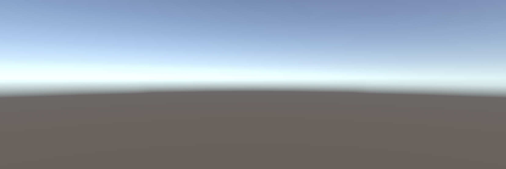

# The Nothings Suite

*...*

---

_The Nothings Suite_ ...

#### [Nothing](https://pippinbarr.github.io/the-nothings-suite/twine/) (Twine)
#### [Nothing](https://pippinbarr.github.io/the-nothings-suite/inky/) (Inky)
#### [Nothing](https://pippinbarr.github.io/the-nothings-suite/bitsy/) (Bitsy)
#### [Nothing](https://pippinbarr.github.io/the-nothings-suite/flickgame/) (flickgame)
#### [Nothing](https://pippinbarr.github.io/the-nothings-suite/puzzlescript/) (PuzzleScript)
#### [Nothing](https://pippinbarr.github.io/the-nothings-suite/pico8/) (PICO-8)
#### [Nothing](https://pippinbarr.github.io/the-nothings-suite/inform7/Nothing.gblorb) (Inform 7)
#### [Nothing](https://pippinbarr.github.io/the-nothings-suite/construct3/) (Construct 3)
#### [Nothing](https://pippinbarr.github.io/the-nothings-suite/stencyl/) (Stencyl)
#### [Nothing](https://pippinbarr.github.io/the-nothings-suite/unity/) (Unity)
#### [Nothing](https://pippinbarr.github.io/the-nothings-suite/unrealengine4/) (Unreal Engine 4)
#### [Nothing](https://pippinbarr.github.io/the-nothings-suite/print-and-play/nothing.pdf) (Print-and-Play)
#### [Nothing](https://pippinbarr.github.io/the-nothings-suite/renpy/) (Ren'Py)

---

#### Read the [Press kit](https://github.com/pippinbarr/the-nothings-suite/blob/master/press/README.md) for press information
#### Read the [Process documentation](https://github.com/pippinbarr/the-nothings-suite/blob/master/process/README.md) for process journal, to do list, and related work
#### Read the [Commit History](https://github.com/pippinbarr/the-nothings-suite/commits/master) for step-by-step information about how the project was built
#### Look at the [Code Repository](https://github.com/pippinbarr/the-nothings-suite) for source code etc.

---

_The Nothings Suite_ is licensed under a [Creative Commons Attribution-NonCommercial 3.0 Unported License](http://creativecommons.org/licenses/by-nc/3.0/).
