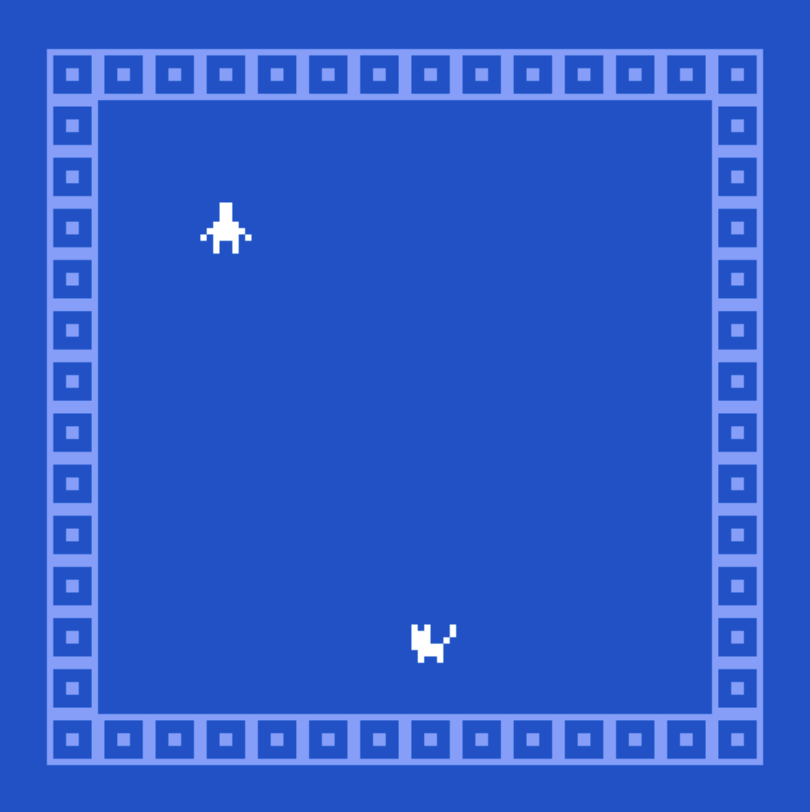
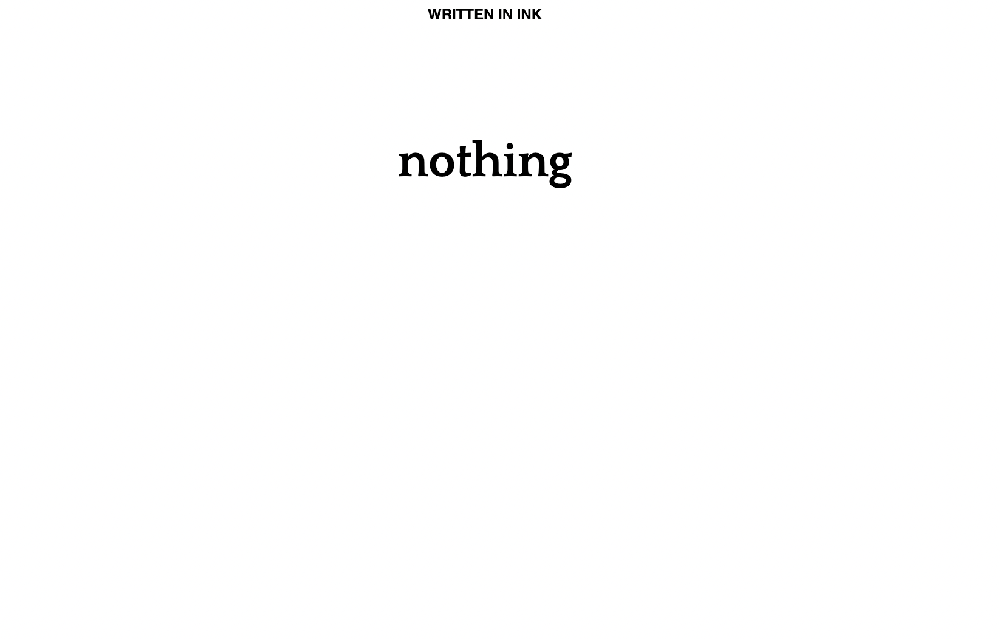
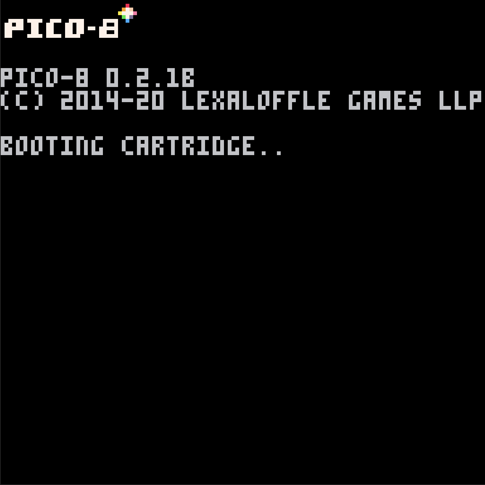
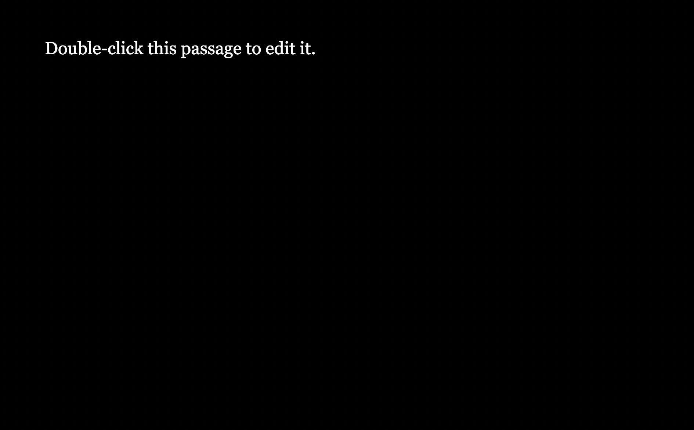
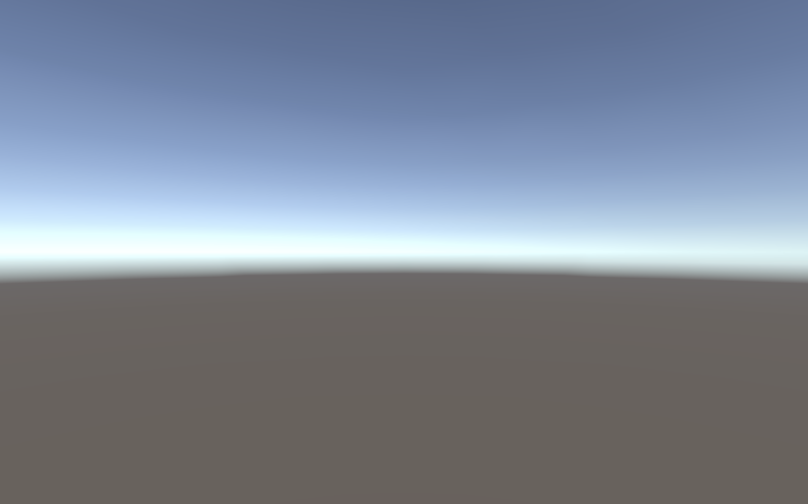
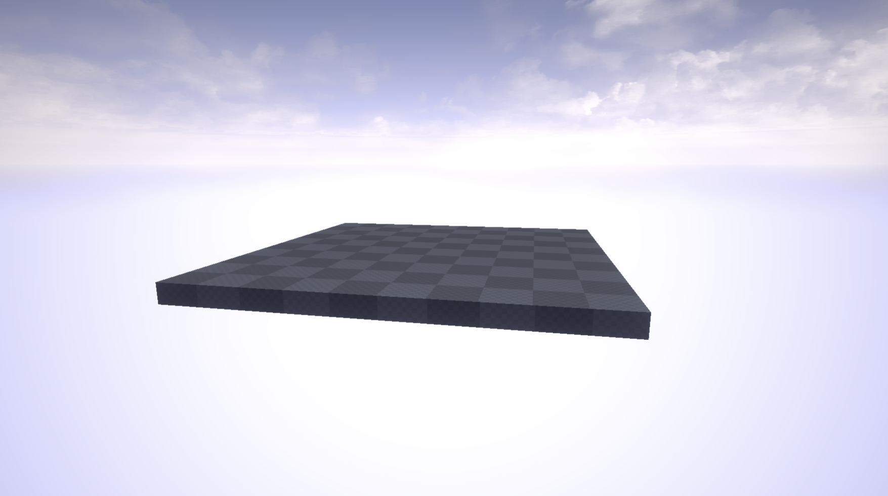

# *The Nothings Suite* Press Kit

*Nothing to see here! But don't move along! You can really see the nothing here! Examine the nothing! Think about the nothing! The nothing is where it all begins!*

#### [Play *The Nothings Suite*](https://pippinbarr.github.io/the-nothings-suite/)

## The basics

* Developer: [Pippin Barr](http://www.pippinbarr.com/)
* Release: 21 April 2021
* Platform: Browser (desktop and mobile)
* Code repository: https://github.com/pippinbarr/the-nothings-suite
* Price: $0.00

## Who is this Pippin Barr guy?

[Would you like to know more?](https://www.pippinbarr.com/about.html)

## Description

*The Nothings Suite* is a series of games made with game engines (or related tools) with the express objective of making "nothing" in each. That is, each game (each of which is called *Nothing*) was created with the absolute minimum of creative or other input into the engine used to create it. The ideal sequence was to open the tool, start a new project (naming it *Nothing*), and then to export that project immediately without adding or subtracting anything. It didn't always work out that way, but that was the idea.

The resulting games are as diverse as the engines that made them, and offer an opportunity to think about the nature of those engines separately from their creative use. From the sterile but relaxing horizon of the Unity *Nothing* to the confident cat in the Bitsy *Nothing* to the permissiveness of the blank page PDF *Nothing*, each one tells a story of potential. Potential unrealized, but realizable. Perhaps by you.

## History

*The Nothings Suite* came about as an idea at the end of 2020 as the pandemic dragged on and I continued to get next to nothing done creatively. As with much of my work, the initial idea was a little joke I made to myself in my own mind - just make a whole lot of nothing - but it expanded into a concerted effort to really collect together diverse nothing games and to think about the process of making them and the player experience each one offered. Making the nothings didn't take very long, as you might imagine, though there were some stumbles along the way you can read about in the [process journal](https://pippinbarr.github.io/the-nothings-suite/process/process-journal.html) if you're interested. Pandemics being pandemics, and the teaching semester being the teaching semester, I've only gotten around to releasing the Suite in April 2021. Such is life.

## Technology

*The Nothings Suite* was created using the following game engines/tools/technologies:

* [Twine](http://twinery.org/)
* [Inky](https://github.com/inkle/inky/releases/tag/0.12.0)
* [Bitsy Game Maker](https://ledoux.itch.io/bitsy)
* [Flickgame](https://www.flickgame.org/)
* [PuzzleScript](https://www.puzzlescript.net/)
* [PICO-8](https://www.lexaloffle.com/pico-8.php)
* [Inform 7](http://inform7.com/)
* [Construct 3](https://www.construct.net/en)
* [Stencyl](http://www.stencyl.com/)
* [Unity](https://unity.com/)
* [Godot Engine](https://godotengine.org/)
* [Unreal Engine 4](https://www.unrealengine.com/)
* [Ren'Py Visual Novel Engine](https://www.renpy.org/)
* [PDF](https://en.wikipedia.org/wiki/PDF)

If you have a tool you'd like to see added to the Suite, let me know and I'll do my best.

## License

*The Nothings Suite* is an no-source game licensed under a [Creative Commons Attribution-NonCommercial 3.0 Unported License](http://creativecommons.org/licenses/by-nc/3.0/). You can obtain the source code from its [code repository](https://github.com/pippinbarr/the-nothings-suite) on GitHub. All code generated by the engines used in these projects has its own copyright that you should respect separately.

## Features

* Nothing
* A whole lot of nothing
* A cat
* A floating platform
* Several loading bars
* Eileen

### [Trailer](https://www.youtube.com/watch?v=nothing)

## Images

  
*Nothing* (Bitsy)

  
*Nothing* (Inky)

  
*Nothing* (PICO-8)

   
*Nothing* (Twine)

   
*Nothing* (Unity)

   
*Nothing* (Unreal Engine 4)

## Press

* Rob Beschizza. [What happens when you export the simplest possible "game" from Unity and other game dev environments?](https://boingboing.net/2021/04/19/what-happens-when-you-export-the-simplest-possible-game-from-unity-and-other-game-dev-environments.html). Boing Boing. 19 April 2021.

## Additional Links

* [Process documentation of *The Nothings Suite*](https://pippinbarr.github.io/the-nothings-suite/process/)
* [Commit history of *The Nothings Suite*](https://github.com/pippinbarr/the-nothings-suite/commits/main)

## Credits

* Pippin Barr: design, code, etc.
* All the fine people who built the software that built the nothings

## Contact

* Email: [pippin.barr+press@gmail.com](mailto:pippin.barr+press@gmail.com)
* Website: [www.pippinbarr.com](http://www.pippinbarr.com/)
* Twitter: [@pippinbarr](https://www.twitter.com/pippinbarr)
* Instagram: [@pippinbarr](https://www.instagram.com/pippinbarr)
* Facebook: [Pippin Barr](http://www.facebook.com/pippin.barr)
