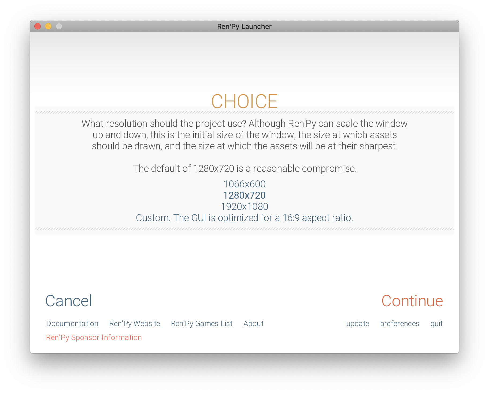

# Nothing is nothing

## Introduction

*The Nothings Suite* is a project I've been chipping away at since late 2020. In short, it's a suite of videogames (and one print-and-play game) made with different game engines, from Unity to Bitsy to Ren'Py. In each case, my objective was to produce the minimal effort game with each engine. Essentially my method was, as far as possible: open the engine, start a new project, do nothing, and export the results. The Unity *Nothing* looks like this, for example:

It's about as silly a project as I've undertaken, but my intuition was that producing "nothing" with each of these engines would reveal something about them. Most obviously, making nothing in an engine shows what the engine "thinks" the minimum project is, and this tells us about the engine's personality or cultural perspective. No surprise, then, that it turns out the **nothing is nothing** and that there are a number of observations to be made about these games. In the following sections, I'll briefly highlight five themes I found interesting: the *development process*, the *technical* nature of the works produced, the resulting *visual aesthetics*, the *player agency* or lack therein, and the tendency of several engines to *refer to themselves*.

## Making nothing

The ideal development process described above didn't always work out in practice. Every game engine has its own ins and outs, its own desires. The most evocative stumbling block I ran into was with [Inky](https://github.com/inkle/inky/releases/tag/0.12.0), the development environment for writing interactive fiction in the [Ink](https://www.inklestudios.com/ink/) scripting language. The Inky environment loaded with the perfect setup: there was *nothing* in the editor window for the story. However, it turns out that Inky wouldn't export a project that I hadn't written anything in. I thought my dreams were dashed, but in fact I was able to write the letter "e", save the project, delete the "e", and then export the project with nothing in it after all. The act of writing was so baked into the engine that it needed me to write something, anything, even if I deleted it afterwards.

That ephemeral "e" still haunts me to this day. (**Note:** in the version of Inky that exists as I write this, 0.12.0, there's a placeholder story instead of nothing.)

There were plenty of other rather involved, but less inspiring issues in the process. [Godot](https://godotengine.org/) required me to download an "export template" (400MB of template!) before I could actually create a game with it. I accidentally used a version of [Unity](https://unity.com/) in Unity Hub that didn't have a WEBGL export installed and so had to switch versions. I couldn't create a web version of my [Inform 7](http://inform7.com/) Nothing because it required adding a line of code to the story ("Release along with an interpreter.") which would break my rule of doing nothing as much as possible. [Ren'Py](https://www.renpy.org/) has a rather imposing series of decisions around color schemes and resolution that you have to make before finally exporting your nothing to the world.

## Nothing but potential

Moving to the works produced, the *Nothings Suite* represented an encouragement to think about the actual manifestation of a game project specifically as a bunch of files, and most obviously as a bunch of *code*. It was true of the vast majority of the nothings I made that they still consisted of a significant amount of data when exported because the engines that produced them, in a basic sense, don't *know* that they're nothing and so include all (or much of) the potential of the engine's capacity to go along with the game project that doesn't use (much of) it. The [Unreal Engine 4 Nothing](https://pippinbarr.github.io/the-nothings-suite/unrealengine4/) was the heavyweight of the suite, yielding files totalling 119.4MB of data. Of this, the majority is the `UE4Game.wasm` [Web Assembly](https://webassembly.org/) file presumably containing the bits of Unreal Engine 4 deemed "necessary" to the project. That is, as they say, a *whole lot of nothing*.

The size of the Unreal Engine 4 data places huge emphasis on it, but we see the same pattern in the other nothings: a game engine is generally exporting the *potential* of the engine alongside your project's use (or disuse) of that potential. The [Godot Nothing](https://pippinbarr.github.io/the-nothings-suite/godot/Nothing.html), which doesn't even run, is around 21MB. The [Unity Nothing](https://pippinbarr.github.io/the-nothings-suite/unity/) is closer to 3MB. Given the similarity of these three engines, each designed primarily to create 3D worlds, it's interesting to speculate about the differences in size. Is Unity more intelligently assessing the lack of content in the project and thus not exporting all its fanciest bits and pieces like reflection probes and physics systems?

This story of potential is even more evident in the smaller scale engines like [Bitsy](https://ledoux.itch.io/bitsy) or [Flickgame](https://www.flickgame.org/). Here we can view the (JavaScript) source of much of the engine itself as well as the (lack of) data added as part of the project. It's possible to literally scroll through all the things that the engine *could do* if the project only gave the word. The [Flickgame Nothing](https://pippinbarr.github.io/the-nothings-suite/flickgame/) sits idly by, but the computational potential is there for a blizzard of linked images and meaning just as much as for any other project.

## View to a nothing

One of the most relatable elements of *The Nothings Suite* is the visual outcome of each of the projects, what you see is often exactly and only what you get. There are, as you might expect, a number of empty rectangles featured in the suite. The [Flickgame Nothing](https://pippinbarr.github.io/the-nothings-suite/flickgame/) and [Construct 3 Nothing](https://pippinbarr.github.io/the-nothings-suite/construct3/) both include this:

  
*Nothing (Construct 3)*

The [Stencyl Nothing](https://pippinbarr.github.io/the-nothings-suite/stencyl/) does too, but has a little extra charm in the way it fades from a black loading screen to a white canvas that is invisible against the webpage background, as if it were acknowledging its nothingness gracefully.

  
*Nothing (Stencyl)*

Other instances offer at least a little hint of a game to hold onto. The [Inky Nothing](https://pippinbarr.github.io/the-nothings-suite/inky/) presents a blank document with a title (nothing). The [Unity Nothing](https://pippinbarr.github.io/the-nothings-suite/unity/), pictured at the top of this essay, shows the familiar and soothing horizon of the default skybox illuminated by the default directional light. Still others provide not just visuals but *action*.

## Nothing to do

The majority of the nothings produced aren't interactive - you can't fly through Unity's peace skies and you can't click through new new pages in the Flickgame version. There are, however, a set of nothings that do allow for user interaction, generally thanks to providing some degree of template project for a user of the software to engage with. The [Bitsy Nothing](https://pippinbarr.github.io/the-nothings-suite/bitsy/) consists of the default room, avatar, and cat. You can move around and even talk to the cat by bumping into it.

  
*Nothing (Bitsy)*

In both this case, and in the case of the [PuzzleScript Nothing](https://pippinbarr.github.io/the-nothings-suite/puzzlescript/nothing.html), which provides a simple [Sokoban](https://en.wikipedia.org/wiki/Sokoban) level, the cosy little pre-made environment would seem to emphasize a desire to welcome the user of the tool in, to show them the ropes in an accessible way, and this is in keeping with the open, community-focused nature of those tools. The Sokoban level in the PuzzleScript Nothing can be won, returning you to the menu and perhaps making this most officially game-like of the nothings. The [Unreal Engine 4 Nothing](https://pippinbarr.github.io/the-nothings-suite/unrealengine4/) is also interactive, allowing the player to fly around a cloudy sky and bump into a floating platform, again presumably in order to show a first-time user of the software how to include some of the most basic components of the engine:

  
*Nothing (Unreal Engine 4)*

The [Inform 7 Nothing](https://pippinbarr.github.io/the-nothings-suite/inform7/Nothing.gblorb) (download only) is both an empty void and a highly interactive place. Due to the nature of the interpreter that is at the heart of playing this form of interactive fiction, there are many, many default actions that can be taken in the "Example Location" that appears in the game by default. Thus the player can jump ("You jump on the spot"), look at themselves ("As good-looking as ever") or even hug themselves ("You don't get much from that"). This range of possibilities speaks to the implied potential present in the sheer amount of data present in the nothings produced (the Inform 7 `.gblorb` file is 608KB).

In a different direction, the [Ren'Py Nothing](https://pippinbarr.github.io/the-nothings-suite/renpy/) is replete with a truly impressive amount of user interface for the nothing it contains. There are menu systems, a saving and loading system, a dialog display system, and more. This is all in keeping with its nature as a visual novel engine, which apparently comes with a rather substantial set of expectations in terms of how one manages the play of a visual novel. There's even a small amount of actual dialog in which a character called Eileen tells you you've created a Ren'Py game and can soon send it out into the world! If you run through this two-line dialog sequence, you finish the game and return to the menu.

  
*Nothing (Ren'Py)*

## This nothing brought to you by

Following on from the interactive nature of the Ren'Py Nothing, we can also see that it's a little "meta" in the sense that it mentioned the engine itself: "You've created a new Ren'Py game". A number of the engines in the suite mention themselves in some way in the game produced. PuzzleScript, Flickgame, and Inky all provide a link to their homepages as part of the default release of a new game made with them. Even if it could be said to interfere with the dream of total control over the player experience, there's also something pleasing about this. Linking to the tool that made the game is a way to offer to pull the player across the divide between creators and users, to suggest that they could make their own thing. Other engines feel more brash, just straightforwardly advertising themselves with their logo, as in the case of the Construct 3 default loading screen or the Unity WEBGL default page. Here it doesn't seem so friendly and more product-oriented.

Finally, my favourite self-reference of all is the [Twine Nothing](https://pippinbarr.github.io/the-nothings-suite/twine/)'s simple message of "Double-click this passage to edit it." This isn't an invitation for the player of the Twine Nothing to interact with it, but rather a vestige of the creation process: Twine always has a single "passage" (page) present in its editor when you start a new project, and it has this message in it to let you know you can edit the text and change it to whatever you'd like. It's the opening incantation of the magic of making your own game, and I love that it makes it all the way through to the released game in this case.

## Conclusion

So, just as we began: nothing is nothing. In producing a suite of games where the stated objective was essentially not to lift a single creative finger, I found a diverse array of insights into the natures of these engines and their personalities. And that's something.
