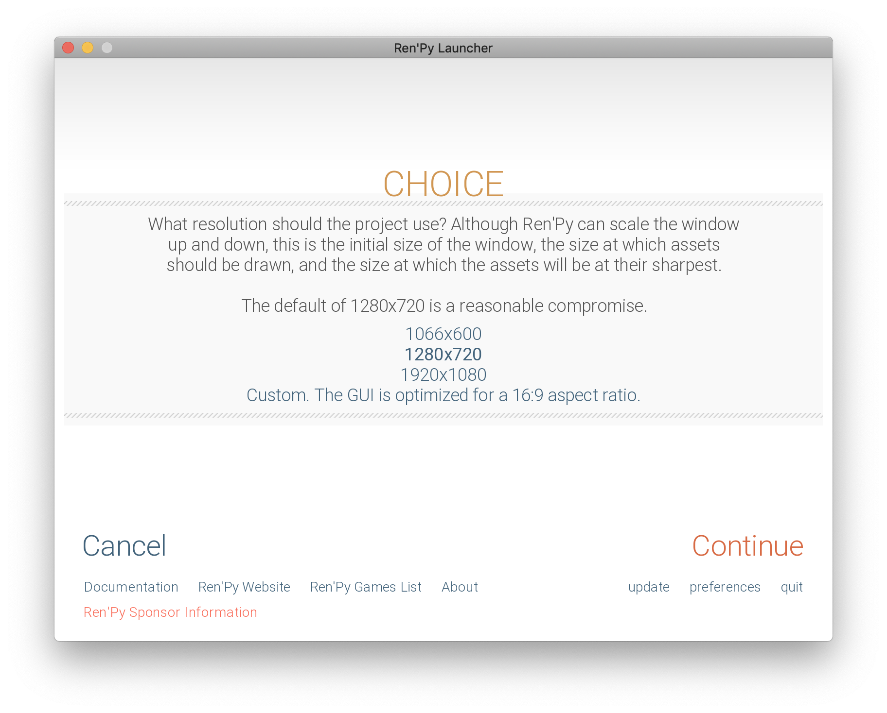
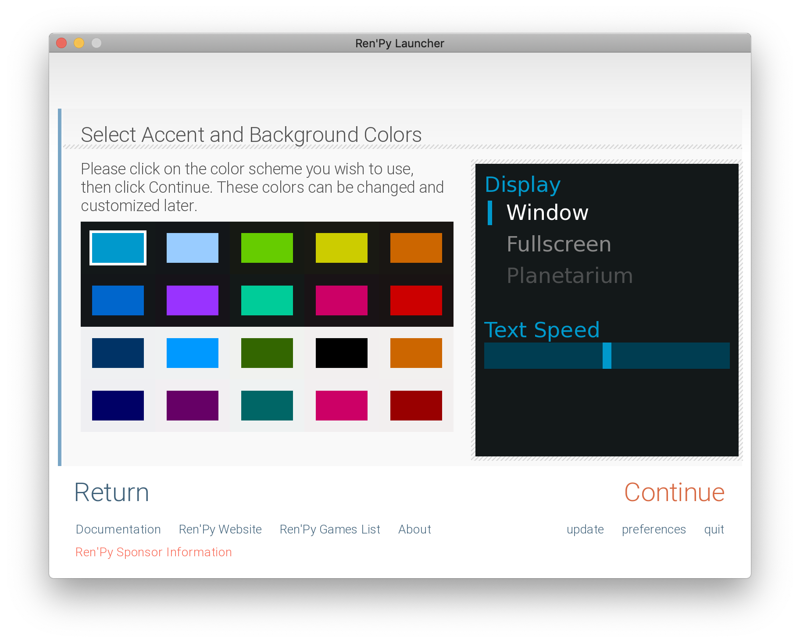
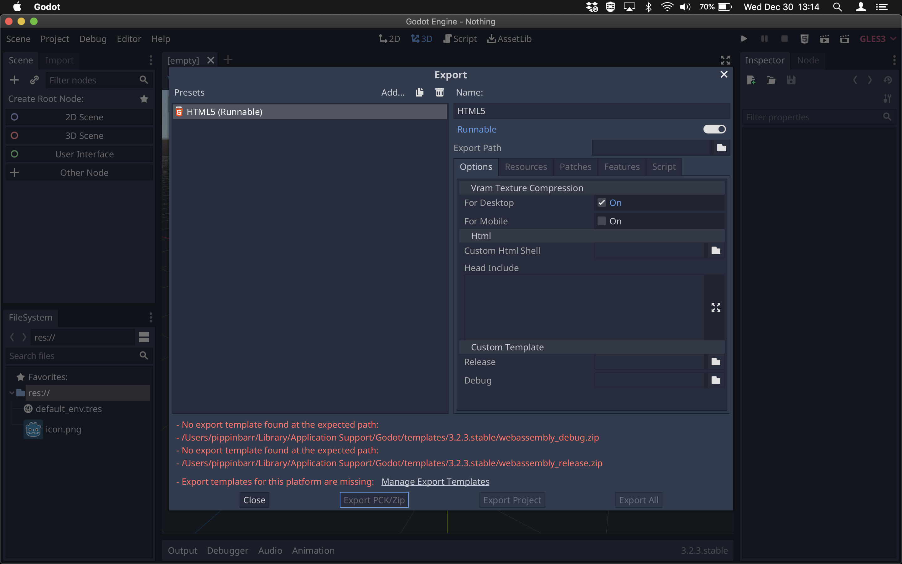
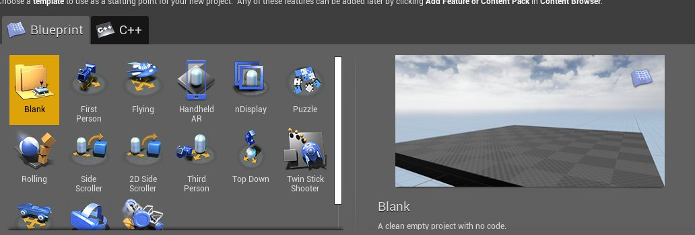

# First thoughts (Tuesday, 22 December 2020, 11:12AM)

It's been a fast-paced project. I started it officially yesterday morning and since then I've accumulated 11 nothings. That's a whole lot of nothing.

Currently the big one I'm missing in the Unreal Engine, which I can't install on my laptop as it takes up too much space. I *can* release this suite without it, but it does feel a bit fundamental, so I'm pondering ways to deal with that. Seems like Unreal does have a web export ([community supported](https://github.com/UnrealEngineHTML5/Documentation)), so that would mean I could potentially create this version on the gaming laptop rather than install Unreal on this MacBook Pro.

It has felt nice to be so "productive" in terms of churning out different engines' ideas of nothing. They do tend to differ in significant ways, which I'm glad of - it's not just a series of blank screens that don't tell you much. There is, unsurprisingly *something there*. Duh duh duh! Big reveal music effect here.

I feel like this project could be subject to a bunch of different forms of analysis, including some kind of code forensics, as well as the basic aesthetics of the nothing, as well as some of the signification of producing nothing, as well as the processual aspects of producing nothing. I can probably do some basic versions of all of these things here. It's going to make the most sense to write an engine-by-engine review of the nothing experience I assume.

That's a bit of a larger bite than I want to take out of it this morning, but I'll perhaps write a bit about it later today or tomorrow while it remains at least somewhat fresh.

---

# Twine and Inky (Wednesday, 23 December 2020, 10:32AM)

Alright well, as promised I thought I'd write some notes about the specific instances of Nothing I've created so far. I also realized a number of Nothings not yet made like Godot and Adventure Game Studio, so I'll get onto those where possible. Anyway, on with specific notes, roughly in order of creation? Or no just in some order.

## [Twine](https://twinery.org/), originally created by [Chris Kilmas](https://chrisklimas.com/)

Should I be listing specific version numbers of software? No I don't think that's all that important, this isn't an archival effort, though it has a kind of archiving flavour.

Twine involved firing up the software and then exporting it to HTML. The project gets titled Nothing, which displays as the page title in the browser. The default Twine starting point has a single text node with default text in it "Double-click this passage to edit it.". It displays in the default CSS, it has no links and is not interactive.

I quite like that there is content here and that the content explicitly references the process of making a Twine game, even if it's an instruction the player cannot follow. It really marks the distinction between creation and play in a neat and tidy way, the ability to change the game versus the ability to play the game.

As with many of the Nothings, I like that it's *not* nothing too, of course, and that's a recurring theme. It's not a blank page. As with any Twine, under the hood is the actually Twine JavaScript as well, so it's a 295KB file despite being just some text on the screen. I don't know enough about Twine to know whether the JS is reading data in from the page and then rendering it to the screen or not. When I inspect the page I see the same tags etc. so I think this particular passage, being the starting passage, is pre-rendered into the HTML, which makes the JS actually completely non-functional (except that it may well still be doing some stuff on startup anyway?). Looking through the minified code doesn't tell me a lot - I can't find a `window.onload` anywhere to most obviously suggest there's code running from the very beginning, ... oh wait, there it is. There's an `addEventListener` for "DOMContentLoaded", so it's likely there's JavaScript running on the page, even if it's not "needed". Such is life for game engines. They can't know in advance what content you're providing for them to interpret, so they have to try to interpret what's there, even if it turns out not to need interpreting.

So, quite a lot of nothing going on with this one. I think the reveal of the inner part of the application through its default "Double-click here" message is really nice for this one. The creation application shows up explicitly (through language) in the played artifact.

## [Inky](https://www.inklestudios.com/ink/), by [inkle studios](https://www.inklestudios.com/)

Inky isn't a tool I've ever used to actually make something, though I've played a few Inky games I believe. The nothing in this case is just the word "nothing" in a pleasing font, representing the title of the "story". Actually, this is true of Twine too to some extent, but there's something worth noticing about the fact that in the context of this tool what we're seeing is a *story* of Nothing rather than a game per se?

An immediately noticeable extra part here is that there's a link at the top of the page "WRITTEN IN INK" that links to the "ink" page on the inklestudios website. So this is another way of referring to the tool of production, but more explicit, more like advertising. I quite like the accessibility implications of this, even if it's perhaps not so artistically satisfying as a hermetically sealed story in a webpage. Someone looking at this story (or a less nothing one) gets to find the tool itself if they're interested in crossing over.

The source code for the Inky version shows very simple HTML as well as linking to three separate JS files. There's `ink.js` which is presumably the ink engine itself, obfuscated via minification. Can't make much of it at all. There's also `Nothing.js` which is interesting given that the story has no content at all. It contains the following:

```javascript
var storyContent = {"inkVersion":19,"root":[[["done",{"#f":5,"#n":"g-0"}],null],"done",{"#f":1}],"listDefs":{}};
```

Most of that is mystifying (especially the `#f`s), but you can see it's roughly speaking just the base level data structure for the story and contains almost nothing. Not nothing though.

`main.js`, the last source file, is not minified and is not super long and is even commented! Can see that a `continueStory()` function is being called to kick off the story, which presumably stalls out when it finds out there's no data. It's interesting how little code there seems to be here in the main script to drive the engine forwards - feels like a neat package, all the action is in `ink.js` I guess.

Also of note with Inkle, the software I used to make this, is that I couldn't export the "nothing" it starts out with. The program loads with a blank page, but I couldn't export it to HTML until I typed a character, saved it, deleted it, and saved it again. So there was this sense I had to really consciously signal I wanted the nothing that was already there. Raises the question of whether it's still "nothing" if I had to exert this particular effort to get it to a releasable state, even if that state is (roughly speaking) the same as the starting state? Is there a ghost of that character (I think it was an "e") that I typed hovering over this project?

---

# Bitsy, flickgame (Wednesday, 30 December 2020, 12:36PM)

## [Bitsy](http://www.bitsy.org/), by [Adam Le Doux](https://ledoux.itch.io/)

I'm a major Bitsy fan of course and used it to make [b r 1](http://www.pippinbarr.com/games/2018/05/23/b-r-1.html), [Let's Play: Ancient Greek Punishment: Bitsy Demake](http://www.pippinbarr.com/games/2019/07/17/lets-play-ancient-greek-punishment-bitsy-demake.html) and [b r 3](https://pippinbarr.github.io/b-r-3/info/).

As a nothing it's one of the more something ones. The default setup (care of Adam Le Doux) involves a simple avatar, a room with walls, and a cat that says "I'm a cat" when you walk into it. This speaks to the accessibility of the engine and its general attitude of friendliness (a cat!). This way it provides examples of a large amount of functionality in a really simple way. It also includes a cup of tea, though for some reason that's not positioned in the scene by default so you don't see it in the nothing, though I presume it's in the underlying code? Just checked and yes. In fact there's a "key" in the underlying code as well. At any rate, the way this "nothing" is designed is to bring people into the experience super fast - you could just redraw a couple of things and begin to have your own understanding of the tool but also your own aesthetic stamp on it. So the tool doesn't emphasize its (quite significant) possibility space (as other engines like Unity do by kind of giving you just nothing, a void with a horizon) in favour of being accessible and non-threatening.

Like pretty much every engine, there's a ton of code underneath the "nothing" that represents the engine itself which *could* do a bunch of stuff if there were more data to crunch. As it stands there's data too, but it's the default data for the wall, cat, avatar, key, and room. In the end this nothing is 196KB, which ain't nothing.

## [flickgame](https://www.flickgame.org/), by [Stephen Lavelle](https://www.increpare.com)

This is [Stephen Lavelle](https://www.increpare.com/)'s ultra-accessible game engine in which all interaction is based on hyperlinks which are based on colours. So you have clickable bitmaps where specific colours lead to new scenes/pages. And that's it! It's beautifully simple conceptually.

The nothing is just the default scene, which is quite delightfully a dark aubergine kind of colour. I like that it isn't black or white or something other more "neutral" colour, it indicated a personality despite its extreme blankness. You can't click the colour to go anywhere because there's no link programmed in.

In a testament to the simplicity of the engine, the HTML file is a mere 17KB, almost certainly the smallest of the nothings (well except for the blank PDF print-and-play). In the HTML there's some initial CSS, and then a dataset which I suppose I'd assume is a listing of the colour of every pixel in the one scene that there is? There are a lot of 0s, which you would think would mean black, but maybe it means "blank" in this context? In the end I can't really tell without seriously getting into it, which I don't think I'm up for right now. I could also ask Stephen, but I think it's okay if this remains a mystery at the moment.

It still takes a pretty decent amount of JavaScript to make this whole thing work, and it's not obfuscated which is quite nice - you can genuinely read and understand it, though it's uncommented (for size reasons I'd assume). It's also written entirely in plain JavaScript with the DOM rather than using an extra library like jQuery or similar.

---

# PuzzleScript  (Thursday, 31 December 2020, 12:30PM)

## [PuzzleScript](https://www.puzzlescript.net/), by [Stephen Lavelle](https://www.increpare.com)

Somewhat like Bitsy, PuzzleScript provides a fairly detailed template as it's starting point, with a little Sokoban level to solve if you run it. To this point it's the only "nothing" that represents whatyou might think of as a playable game, even having a menu and a win condition. It's not the world's most complex game (push the right arrow three times to win), but it's a proper game with underlying mechanics and so on.

For that reason it's pretty interesting that the actual PuzzleScript source for the game is really, really simple. Presumably this is the point, to demonstrate the ability to make quite sophisticated gameplay with minimal effort (or at least non-length effort). The PuzzleScript source is 69 lines long, commented, and quite intelligible. This is interesting at least in part because it demonstrates a really concerted separation of gameplay and level design I suppose? With the ruleset provided (moving crates onto targets) we know that you can make the entirety of Sokoban, with arbitrarily complex levels, some of which could be insanely hard to solve etc, when in the underlying source they're effectively just diagrams of levels, with the complexity baked into their arrangement of elements.

PuzzleScript being implemented in the browser, it's actually a higher order language on top of JavaScript, so in this particular nothing you of course end up not just with the PuzzleScript source but the source of the PuzzleScript engine on top. In this case the engine is obfuscated through minification to reduce the file size, and it still only comes in at 296KB which is kind of impressive for an entire engine! (Godot is in the background downloading some 400MB template file just to be able to export anything right now, that's over 1300 PuzzleScript engines). It's not actually as easy as I'd expected to find the source of PuzzleScript (it's not obviously linked from the running engine itself), but it's easy enough to google up: https://github.com/increpare/PuzzleScript. I'm not going to go through the source code itself, but it's interesting somehow that this repository is representative of the "nothing" I have in this suite, just in an expanded and (much) more legible form.

So the aesthetics of this nothing are very detailed, very not-nothing, and very educational in terms of the engine. They show you the most obvious kind of thing to make with it (Sokobans) and they provide a tiny use case along with its source to help you understand basic possibilities.

---

# PICO-8, presentation (Friday, 1 January 2021, 14:05PM)

## [PICO-8](https://www.lexaloffle.com/pico-8.php), by [Lexaloffle](https://www.lexaloffle.com/info.php)

This was one of the more complicated nothings to produce because the PICO-8 system itself has a learning curve just to understand how to export anything at all. I also had to buy the "fantasy console" to get going, because although I did have a copy already (somehow? from the Old Days?) I wanted to get the latest version and couldn't find any record of having bought it.

Loading up PICO-8 just gets you a command line, so I ended up having to look a bunch of stuff up in the documentation just to create the basics. That mostly meant creating a new `.P8` source code file and making sure there was nothing inside it, then figuring out how to export that file as HTML5, which also involved needing to take screenshot for the thumbnail. Though as I sit here I'm thinking: why did I do that? Then I remember that it's because it literally wouldn't export without the thumbnail and that is why I did it. Rather than take a screenshot at the precise moment I needed it (perhaps more authentically nothing) I took it of a "blank" screen in the command line. I feel lightly troubled by that aspect of my process.

Experientially the nothing involves the screenshot with a play button on it. When you his play the console loads and does a little flashy intro thing, then gets stuck on "`BOOTING CARTRIDGE...`". I can't tell just by look at it whether there's some internal error in the console caused by the cartridge (source code) being empty, or whether this could be considered the correct behaviour for the console. You load the nothing and then the nothing issues no instructions to get you beyond that loading moment? Hard to say without looking deeply into the source code of PICO-8 itself.

Exported, you end up with an HTML file and a JavaScript file. Quite substantial, both, that JavaScript especially. It's 1.5MB in size, not nothing at all. I guess it's a whole fantasy console in there, doing nothing. I guess this makes me think, in this moment, of this idea present in most of the nothings of potential unrealized - complex structures of code sitting idle or almost idle, paths unfollowed, computation uncomputed. All very poetic and pathos-filled.

## Presentation thoughts

A quick note because it's been circling my mind: it feels like it would be nice to tie writing about this project more closely to the individual nothings with some kind of "discussion" link per nothing that would have a fairly accessible run down of what I think about it? Probably in the vein of the writing above, but tidied up to be a bit more readable etc., maybe with some specific links to commits or files in the actual repo and so on.

And that makes me wonder more generally about surfacing some kind of accessible rundown of each project. Not quite the Closing Statement thing, but perhaps replacing it or something. An accessible summation, separate from any more "academic" write-up I try to do. or maybe you don't replace the discussion but instead right a shorter, more thrifty explanation of what went on and why?

Anyway for now I just want to flag this is a thing I want to think about and try to include in this overall project.

---

# Inform 7 (Saturday, 2 January 2021, 12:37PM)

## [Inform 7](http://inform7.com/)

I've used Inform 7 twice now, once for [Kicker](https://www.pippinbarr.com/2012/11/23/kicker/) and once for the [Text Adventure](https://www.pippinbarr.com/games/2020/01/10/lets-play-ancient-greek-punishment-the-text-adventure.html) edition of Let's Play: Ancient Greek Punishment. I've never found it to be an easy language/environment, it's full of weird things you have to understand and weird (to me) ways of expressing ideas in almost natural (but ultimately quite unnatural) language. I vaguely wonder whether a more standard programming representation of the same underlying structures could be easier quite frankly. The spectre of natural language makes it a bit easier to get things wrong for me, because it prevents me from thinking in terms of more rigorous syntax.

To produce the nothing was relatively straightforward. It was one of the first I went for and as such was part of my debate about whether "nothing" should be represented with empty source code where applicable. Inform 7 is one of those engines that simply doesn't compile without some basic content (you have to have a room). When you load a project it does have a standard "example room" all present and accounted for, though, so you can export that. I took the liberty of explicitly naming the project "Nothing", since that's been a consistent theme across the project, but it's perhaps a little dodgy given that this is a case where it's optional. Although now I go back and look at the process I see that when you create a new project you get to title it on creation. Initially I'd kept the default (Untitled), but these days I title the project Nothing each time for a bit of completeness. It also auto-adds my authorship which I think is kind of interesting.

The entirety of the source is:

```
"Nothing" by Pippin Barr

Example Location is a room.
```

Which is pleasing in its blankness and also its non-nothingness.

Inform 7 turns out to be one of the more interesting Nothings for me for a couple of reasons. First (maybe less interesting) is that I found out I couldn't export to HTML5 even though the engine is capable of it because to do so requires adding to the source code - it's in Inform's nature that you do almost everything through language in its source, rather than through menu options for example. So to export as HTML you need to add

```
Release along with an interpreter.
```

But of course that's no longer the same Nothing that you begin with. It does raise the question of whether even exporting these things is some kind of rule violation, or whether exporting them in a "non-native" (whatever that means) format is some kind of rule violation. Of course, I'm making the rules here, and it seems legit to me to export, for example, Unity in WEBGL. But it raises some kind of question about the difference between doing that with menus and doing that with text inside the source code. I guess my rule is just that there shouldn't be alterations of the source, pretty fundamentally. In a way, it's a data-oriented view of nothing: no additional data added by me (except the title).

So the end result of not adding the interpreter line is that I can't release the game in any form except a `.gblorb` file, which can only be used with a separate interpreter. I think that's kind of fun, that it also invites you, in a way, into the larger world of these kinds of text adventures. Playing the nothing gives you something that would let you engage with IF - an interpreter.

The other thing that is maybe more interesting is that way that the nature of Inform 7 as an parser-based system exposes all the potential that exists in a way that other engines do not. Most of the Nothing end up loading some kind of static, non-interactive experience of one kind of another. Because Inform 7 is interpreted there's a ton of built-in response (that you would normally override) to all these built-in verbs you can use. In the example room you can kind of run, look, jump, sleep, etc. etc. etc. It builds a very definitely sense of presence in this nowhere. You can look at the room you're in, for instance, and see literally nothing (not even text saying you don't see anything). You can hug yourself. And so on. So it's a way of showing all the stuff that's built in - it still serves as a way to explore Inform 7 itself and its default possibilities, or at least a number of them.

For what it's worth the `Nothing.gblorb` is 604KB. Not huge, not tiny. I suppose that tells us something about a division of labour between what the interpreter software would do and what the story data is composed of. I'm a little unclear on what's going on in there, though, as the `.gblorb` isn't human-readable. Clearly it's more than just a representation of my source code. Perhaps it's a representation of all the default possibilities an Inform 7 game has?

Anyway, Inform 7 is definitely one of the interesting ones, huh?

---

# Ren'Py, Godot (Monday, 4 January 2021, 10:26AM)

## [Ren'Py](https://www.renpy.org/)

I was interested to look at Ren'Py because it's definitely part of my consciousness, I suppose chiefly because of that Dating one called...? *Save the Date*, that's right. Anyway, that's what I know Ren'Py as to some extent, but more generally than that I think of the visual novel thing as both very alien (I bounced off the few I've tried pretty hard) and as important/super popular. So, "using" Ren'Py would be interesting.

However, in creating the nothing it pointed out another element of all this, which is that making nothing in an engine doesn't necessarily tell you very much about what it's like to use the engine to make anything. To make nothing in Ren'Py was a bit of a process with multiple setup screens like these two:


*Selecting a resolution*


*Selecting a color palette*

But after that it exported without much difficulty on my end. Because I didn't really engage with producing any content, I really have no idea how you make anything in Ren'Py. This is different to my experience with something like Inform 7, for example, where I know a bunch about the underlying framework of the engine and what it provides, so I can kind of sense the depth of the nothing. With Ren'Py I really can't.

In terms of the experience of the resulting nothing, it's pretty elaborate! It first loads stuff with a little loading back and even downloads and extracts a specific data file (with my nothing in it I suppose). There's a big splash screen with "Ren'Py loading..." and a woman holding a globe in her hands. Very elaborate and very, very specific aesthetic. I assume you would replace this stuff if you were making something for real, but it's interesting that it's in there and tells us some things about the basic expected use/genre of Ren'Py. Once loaded, you get an entire menu system for "Nothing 1.0" including the ability to Start, Load, set Preferences, read About it, and get Help! This is a ton of functionality I didn't put in there, all placeholder.

Help gives me some default guidance on keyboard commands within the Ren'Py reader. The About contains a reference to the specific Ren'Py version and some licensing information. Preferences lets me set a ton of reading preferences. Load lets me load notional saved games. Start lets me start this one...

When you Start the nothing you get a couple of overlapping red errors at the top due to files I haven't provided, which is kind of interesting - they have no default provided so you get actual problems right away. You also get some dialog from a character called Eileen who's saying placeholder text about how I've created a new Ren'Py game and how I can add the story and pictures and then release it to the world. Then the game ends. At the bottom while the story runs are a host more menu items including saving, skipping, preferences, etc. There is just a ton of framework around the core of nothingness I provided. I guess this tells us just how structured Ren'Py is, perhaps more than the other engines I've looked at it has really rigorous expectations for how things will be and builds a larger set of tools than something like Twine. It's more "professional" in that way?

In terms of the source itself, there are a lot of files involved in this and the overall directory of Ren'Py stuff is 8.4MB, so quite significant given it's an empty experience (sort of). I sort of feel overwhelmed by all the different components here, the lion's share of which I suppose are based around getting Ren'Py into HTML5 form. There's no easy-to-read instance of the "nothing" data I actually provided to the game.

## [Godot](https://godotengine.org/)

Godot is one of those important engines that I would in principle like to use or have used, but haven't because I already learned Unity and don't have the energy or virtue to learn Godot properly. Or something along those lines. Really enjoy that it's Open Source and noble. As with Ren'Py, just producing a nothing with it didn't tell me much beyond a very quick glance as its basic presentation on load and then a fight to get it to export.

In particular, just trying to immediately export to HTML5 turns out not to work because you don't have a "export template" installed:



Easy enough to fix with a 400MB download(!) and then the nothingness is exported successfully as a mess of files. Because I exported into the working directory I was building the project in, I can't actually tell which of the files are part of the exported HTML5 nothing versus the Godot project Nothing. I guess I should untangle them. There I did that, so Godot leaves me with five files in the end, most of it in JS and then a `.wasm` file which is *huge* at 20.5MB for some reason - I assume that kind of the WEBGL player for Godot? Looks like WASM stands for WebAssembly? Which is a way to run things in the browser that are not strictly HTML/CSS/JS stuff? I really don't know. Apparently Unity uses the same basic technology for its Web Player as well. The upshot is that the Godot thing is a big one.

However it also fails in the console of the browser, announcing:

```
Error: Can't run project: no main scene defined.
```

and then failing with an actual error:

```
Uncaught RuntimeError: function signature mismatch
    at StringName::StringName(char const*) (<anonymous>:wasm-function[532]:0x2a4b3)
    at OS_JavaScript::initialize(OS::VideoMode const&, int, int) (<anonymous>:wasm-function[37976]:0x95f2a2)
    at Main::setup2(unsigned long long) (<anonymous>:wasm-function[54399]:0xb56d5e)
    at main_after_fs_sync (<anonymous>:wasm-function[24161]:0x5e7e07)
    at Module._main_after_fs_sync (http://127.0.0.1:3000/Nothing.js:8:323869)
    at ccall (http://127.0.0.1:3000/Nothing.js:8:9246)
    at http://127.0.0.1:3000/Nothing.js:8:23977
```

Presumably this is the same kind of error expressed in code, where there's just no scene for it to load? Hard for me to say though, definitely out of my depth with that. It's interesting, though, that unlike Unity, Godot doesn't provide a default scene when you create a new project. So unlike Unity, which gives you a semi-pleasing view of a horizon, Godot gives you nothing and an error. Decisions decisions.

---

# Print-and-Play (Monday, 4 January 2021, 20:21PM)

## Print-and-Play

I mean, I don't want to sound too clever, but I thought having an analog nothing was pretty fucking good okay? I thought of it in a bath and I felt so very pleased with myself. Created by firing up Microsoft Word, using the Blank template, and exporting to a PDF. One of the smaller games at 12KB.

Quite enjoy the implication of the download link that what you're getting are *instructions* for playing a game called nothing. I suppose at a huge stretch you could say there are no rules and thus total space for imaginative play etc. This is the easiest one to call "not a game" given that it has no game form whatsoever and no obvious game potential baked into the "engine" of a PDF/text document.

I like it. It's probably not the most profound or interesting in terms of theory, but I think it's the funniest and that counts in my books.

---

# Construct 3, Stencyl (Tuesday, 5 January 2021, 10:03AM)

## [Construct 3](https://www.construct.net/)

Another engine that I'm not personally familiar with. Construct turned out to be pretty seamless in terms of exporting a nothing - the actual app exists online, it exported happily enough. There's not even a commit message of interest around how the process went and I literally cannot remember it to speak of. Guess I just ran Construct 3, started a project, and exported it to HTML5. Kind of embarrassing from a process standpoint.

The most memorable thing about the Construct 3 process is that when I ran the Nothing locally it horrifyingly kind of took over my local host and would run when I was trying to run other stuff (like code I was writing for my upcoming class). It has some very sticky offline mode stuff that was annoying to get rid of, and actually involved me deleting two files from the export, making this not the most authentic nothing because I actively removed its offline mode. But it's just so hostile and gross I don't want them in there in case I accidentally run it again and break everything.

That said, there's something quite interesting/nice about an offline-available nothing, so I'm a bit sorry to miss that special feature.

The experience of the Construct 3 nothing is pretty standard: a loading screen ("Powered by Construct 3") followed by a blank white canvas. My removal of the "service worker" for the offline mode leads to an error in the console that wouldn't otherwise be there. The whole package is 1.2MB (without those two files I removed).

Frankly it's a pretty boring one. I feel like Construct 3 just didn't have a lot of material, not much to say on the nothing front.

## [Stencyl](http://www.stencyl.com/)

I always think of Stencyl and Construct 3 as semi-identical, though I'm sure there are proponents of each that could give me a reasoned argument about how they are super different. That's okay. Stencyl was similarly unremarkable in terms of just exporting successfully and yielding a similarly underwhelming nothingness composed of a loading screen and a blank. The Stencyl loading screen is unbranded which is kind of interesting, nothing about it tell you that Stencyl was the tool used, it's just a little loading bar on dark gray. When it's loaded you get a totally blank page, white, with a white canvas on it and nothing happening.

In terms of the underlying source and files, Stencyl's nothing exports in a pretty organized way with an assets folder, a lib folder, an HTML file, and a JavaScript file. 1.5MB in total.

Yeah I mean, just not a lot to write home about? Kind of feels like this fits or is reflective of the personality of this tool (and Construct 3)? Just sort of effective and a bit boring, a bit unassuming? I don't quite know. I guess in presenting themselves as real multipurpose tools there's this idea that the blank template should be totally blank and not suggestive?

I'm just running Stencyl again to examine the process of exporting a nothing. You "Create a New Game" and then choose a template, and the only template that's there by default is "Blank Game" where you "Start from Scratch", so that's what I did. There's a Platformer example project included with Stencyl, but it's not offered explicitly as a template.

---

# Unity (Wednesday, 6 January 2021, 15:51PM)

## [Unity](https://unity.com/)

Unity is certainly a platform I'm familiar with, having made various games in it and taught it in a game design course. It's not necessarily my favourite engine to work in for accessibility and heaviness reasons, but I've always found it pretty fun to work with and I do have a soft spot for 3D.

Creating my nothing in Unity was straightforward in that I just created a new project, added the default scene to the build, and then exported. There was a brief snag when I realized the version of Unity I'd launched didn't have the WEBGL export package installed and I had to restart with one that did (life with Unity Hub), but beyond that it was uncomplicated.

The resulting nothing experience has a single camera pointed at the horizon of a skybox. It's genuinely kind of peaceful and, for me, iconic of what nothing means in the context of game engines. That static skybox is quintessential nothing. Oh I guess there's a directional light in the scene too, by default, but it's not really illuminating anything (except I guess controlling the default dynamic skybox presumably). Totally non-interactive, just a "view".

As I've worked with it plenty, I know all the latent potential the nothing isn't using, but I definitely don't know to what extent the build itself excludes all kinds of code and potentials because it can tell they're not being leveraged. The resulting project folder with the WEBGL build in it is 3.5MB, which really isn't very big and would lead me to think that it's a pretty stripped back version of what Unity can do. Does it have the potential to move the camera? Probably? Does it have the potential for wind or reflection probes? No idea. Does that even mean anything in the absence of using those things in the project? Don't know. It's pretty mysterious to me.

The WEBGL build also includes some little bits of interface stuff, including a loading screen and a fullscreen button and a Unity logo (that doesn't link to their web page oddly). When the load finished you see the classic "Made with Unity" splash and then the static scene after that.

I've debated whether or not I should be providing Windows/Mac/Linux builds of the nothing, whether that would signify anything particularly important or not. Currently I don't believe I care enough to do it - it would make some kind of point about distribution and cross-platform stuff, but it doesn't feel so important. To me the core is what the actual "player experience" of each nothing is alongside any processual stuff to produce it I think.

---

# Unreal Engine 4 (Wednesday, 6 January 2021, 15:51PM)

## [Unreal Engine 4](https://www.unrealengine.com/en-US/)

I don't have Unreal Engine 4 on my computer - I started to install it but it was so huge that I frankly just gave up at the point it told me there wasn't enough room on my drive. Unreal does figure in my imagination around game production because it's always the "other" engine to Unity for me (as Unity is for Unreal people I suppose). It's also the engine a lot of students tend to say they really enjoy using and, at least at one time, that was the idol of graphics chauvinists.

Because I didn't have the engine I contemplated just not including it, but it feels like one of the ones I wouldn't want to miss, so I asked on Twitter for help and received it in the form of [Andrew Baker](https://failrate.itch.io/).

I'll include our entire conversation about the process here for reference!

---

#### Pippin
Dec 22, 2020, 7:06 PM  
Hey there! So the genuinely tiny project in question is to make... nothing. I’m interested in you starting unreal and then just exporting whatever is there by default, if that’s possible with that engine. Titling the project Nothing. As I said if we can do a web export so much the better, but downloads okay too, and perhaps more “authentic” anyway?

#### Andrew
Dec 22, 2020, 9:28 PM  
Do you mean literally empty?  Like, not even a camera?  Because I could just make a black rectangle png and tell you it's an empty project's web export ;)



Dec 22, 2020, 9:29 PM  
How about good old Blank?

#### Pippin
Dec 23, 2020, 10:18 AM  
Haha, you can’t get a black png past me!

So Blank is a project template option when you try to start a new project? Sounds perfect. Yeah, the idea isn’t to delete anything, just to release exactly what “nothing” looks like in the engine. Blank makes sense for that.

I love that “blank” appears to have a floor?

#### Andrew
Dec 23, 2020, 1:37 PM  
Yes, and the default pawn is a free-flying pawn.

Here is the link:
`... Sends file NothingHTML5.zip`

It took an embarrassing amount of effort to create a viable "Nothing" project with UE4.

I verified that it was working in Chrome prior to uploading it.

Dec 25, 2020, 7:27 PM  
Yo, Pippin!  Please let me know what you think.

#### Pippin
Dec 25, 2020, 9:51 PM  
Hey Andrew - apologies, caught up in the Christmas spirit etc. I'm curious about the specifics of the effort! What did you end up having to do? Hopefully nothing in terms of actually changing anything in the Unreal editor itself? In terms of the project I'm happy with whatever it spits out when you export a project based on Blank...

Was it just the HMTL5 export stuff that was a pain? It looked a little painful from a quick glance...

Dec 25, 2020, 9:52 PM  
Just ran it - looks great. So damn weird how involved that is for "nothing"! Kind of great. I guess all the menu stuff is from the HTML5 export. I wonder if I can ask you for a Mac/Windows downloadable? (Also fine to say no!)

#### Andrew
Dec 25, 2020, 11:15 PM  
Oh, shit, yeah, I forgot that it's Christmas day.  Time has lost all meaning for me.
It wasn't too bad, I just had to convince Unreal Engine that I really, really wanted to do the thing I wanted to do.

Yes, the weird UI stuff comes with the HTML5 export.

I'll get a Windows 64 download for you pretty soon.

Dec 25, 2020, 11:17 PM  
And then, I'll try to get a Mac export after that.

Dec 26, 2020, 7:47 AM  
Here's Windows:
`... sends file NothingWindows.zip`

I don't think I can export a Mac build without some iOS developer gubbins:

#### Pippin
Dec 26, 2020, 12:19 PM  
Yeah, Apple is just so helpful like that. No problem - if I get to it I can probably install Unreal myself and do this (but I really like the idea of this Nothing being a collaboration!).

In terms of Unreal and the Nothing - if it's not too boring can you go into some detail about the process? The majority of my rationale for this project concerns that specific process - what does it mean to create nothing in different engines, so I'm genuinely quite interested in what that process looks like for Unreal, and I'm curious about this idea that we're collaborating and so there's a step removed for me where I need to hear about it from you.

In particular, just wondering which bits of it felt like they were "extra", which parts of the engine might have "resisted" making that nothing. Mostly the web export component? At least in Unity it's fairly easy to export nothing - you just start a new project and immediately build and export it - so I'm interested in how Unreal might have been different on that front!
(Also if you're up for it, I'd quite like to include this "correspondence" about the project in the process documentation.)

#### Andrew
Dec 26, 2020, 2:00 PM  
Even though the template starts with a valid placeholder level, that doesn't exist as a real file until I saved as a real new file.  Then, to get it into the exported game file, I restarted UE4Editor, and then picked that level as the gameplay default.  The level was auto-picked in the gameplay default upon creation, but it didn't "take" until after the restart.

Yes, this conversation can be published in its entirety.

But, the thing I was most cautious about was doing as little as possible.

I didn't want to make a fake Nothing.

I can send you the project file, so you can wrangle the Apple port.

Dec 26, 2020, 3:49 PM  
Here is the source project, which you should be able to export to iOS:
`... sends file Nothing.zip`

#### Pippin
Dec 26, 2020, 10:15 PM  
Hugely appreciate the thoroughness of all this Andrew - you get it! I had similar experiences with a couple of other engines, where I couldn't export the nothing until I'd changed it, even if I then reverted it back to the original nothingness. An unnatural occupation.

#### Andrew
Dec 27, 2020, 9:28 AM  
Exactly, it doesn't pass the smell test.  As a matter of principle, I want to be able to launch the editor, click "New", and then immediately save the output.

UE4 has a hundred tiny little flaws like this, but it's still my favorite engine to work with, so far.

And, if I'm feeling saucy, I'm diving down to C++ and doing whatever I want.

But, yeah, UE was historically used by small to big studios that knew what they were doing re: this specific style of pipeline.

#### Pippin
Dec 27, 2020, 1:24 PM  
Interesting to hear about UE4 love. I haven't tried it out myself, ended up using Unity because that's what someone was around to show me the ropes on. C++ sauciness sounds fun!
Really appreciate your collaboration on this one Andrew - I'll of course include our co-authorship on it in the game page and my CV and so on!

---

So that's the saga of Andrew being a real champ and going through the process of producing nothing in Unreal Engine 4. You can see he was really careful about it, which I hugely appreciate - have to confess I felt nervous about handing the reins to someone else for fear that they wouldn't quite take it as deadly seriously as I am in terms of not adding anything to the process if it's avoidable, but Andrew totally got it.

The resulting nothing experience is pretty detailed because unlike Unity, Unreal Engine 4's blank project includes an actual platform with a default texture and a moveable camera that you can fly around with! It's interesting, though, that it does still feel within the realms of nothing anyway? Even though there's solid ground, a sky, and movement, it's so clearly placeholder that it ends up being hard to take seriously as a "world"... it's still not really there, especially with the lack of physics? It's more of a nothing than the default sokobanning in PuzzleScript for example.

The export to WEBGL in Unreal Engine 4, which is handled, I believe, via a community project, also adds a bunch of extra interface stuff when you run it. You see a status message about it downloading the data for the game (31MB!) and there are a bunch of buttons along the bottom: Pause, Resume, Toggle Log, Clear IndexedDB, and FullScreen. They feel like they're partly there for a developer to test things and partly for a standard player. I do not know what IndexedDB is. There's also a message right under the play window saying "Running with IndexedDB access disabled" so it's clearly a thing alright, but do I have the energy to find out more?!

As I play with the scene a little more I see that it **does** have physics in that you cannot fly through the platform! You can fly frictionlessly anywhere, but the platform is actually solid. So it feels quite a lot less like nothing and no-world than I'd thought initially.

---

# Return of the guy who's making this thing (Friday, 9 April 2021, 15:41PM)

Oh yeah, it's three months later. The semester will do that to you. I'm checking back in with this project as I want to wrap it up over next week ideally.

I re-read the journal above and was entertained and more or less still interested in the things I once said. Really in terms of wrapping this the key things are

* Decide how much text should accompany each nothing on the main page (like, do I want a little paragraph with notes about it? a page of notes?)
* Write the public-facing texts based on the journal entries
* That's it?

Really there's not a huge amount to be done with this thing. It feels like it has significant intellectual interest for me personally, but probably not much more than that. I think there's the public-facing bit to try to at least make an honest attempt to have it be intelligible as to why I think it's interesting. And then there's probably the Gamasutra piece / Closing Statement in which I can address some of the broader thematic areas that I've found interesting throughout.
